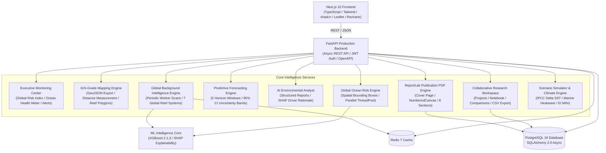
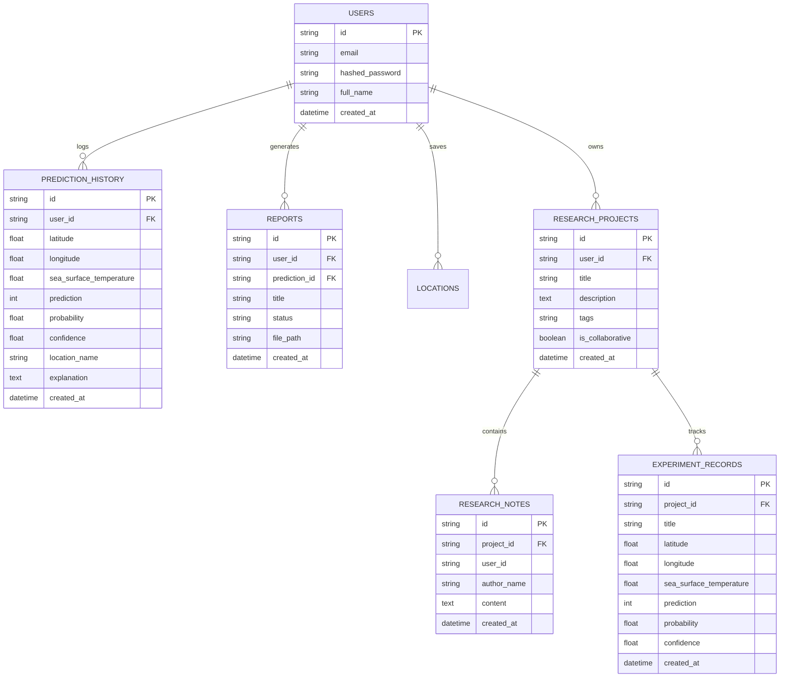

# 🌊 EcoRal — Global Ocean Risk & AI Environmental Intelligence Platform

[](https://www.python.org/)
[](https://fastapi.tiangolo.com/)
[](https://nextjs.org/)
[](https://www.typescriptlang.org/)
[](https://tailwindcss.com/)
[](https://xgboost.readthedocs.io/)
[](LICENSE)

**EcoRal** is a full-stack, enterprise-grade AI Environmental Intelligence SaaS Platform designed for global coral bleaching risk prediction, sea surface temperature (SST) telemetry monitoring, and marine conservation decision support.

---

## 🏛️ System Architecture



---

## 🗄️ Database Entity-Relationship (ER) Diagram



---

## ✨ Key Features

1. **Executive Monitoring Center**:
   - **Global Risk Index %**, **Ocean Health Score Radial Gauge (0-100)**, active thermal anomaly alerts, and high-risk region leaderboards.
2. **GIS-Grade Digital Ocean Map**:
   - Leaflet map featuring 7 modular layers, **GeoJSON Export Tool**, **Geodesic Distance Measurement Tool (km & NM)**, and **Reef Sanctuary Polygons**.
3. **Coral Bleaching Predictive Forecasting**:
   - 5 projection horizons (`1 Week`, `1 Month`, `3 Months`, `6 Months`, `1 Year`) with **95% Confidence Interval uncertainty bands**.
4. **Global Background Intelligence Engine**:
   - Asynchronous worker scanning 7 global reef sanctuaries (Great Barrier Reef, Maldives, Lakshadweep, Red Sea, Coral Triangle, Caribbean, Hawaii).
5. **AI Environmental Analyst Engine**:
   - Generates structured multi-section intelligence reports (`EAR-2026-TREND-01`) detailing thermal anomalies and SHAP feature drivers.
6. **Enterprise Publication PDF Generator**:
   - Multi-page ReportLab PDF generator featuring cover pages, automatic Table of Contents, and `Page X of Y` page numbering.
7. **Collaborative Research Workspace**:
   - Multi-user project tracking, experiment comparison matrix, collaborative research notebook, and CSV dataset exporter.

---

## 🚀 Quick Start Guide

### Prerequisites
- Python 3.12+
- Node.js 20+
- Docker & Docker Compose (optional for containerized setup)

### 1. Local Development Setup

#### Backend Setup
```bash
# Navigate to repository root
cd ecoralla

# Create virtual environment
python -m venv venv
source venv/bin/activate  # On Windows: venv\Scripts\activate

# Install dependencies
pip install -r requirements.txt
pip install -r backend/requirements.txt

# Run pytest backend test suite
python -m pytest tests/unit/ -v

# Start FastAPI server
uvicorn backend.app.main:app --reload --port 8000
```

#### Frontend Setup
```bash
# Navigate to frontend directory
cd frontend

# Install Node dependencies
npm install

# Run TypeScript type check & build
npm run build

# Start Next.js development server
npm run dev
```

---

## 🐳 Docker Deployment

To launch the full EcoRal platform (PostgreSQL 16, Redis 7, FastAPI Backend, and Next.js Frontend) using Docker Compose:

```bash
docker-compose up --build -d
```

Access services at:
- **Frontend App**: `http://localhost:3000`
- **FastAPI API Documentation**: `http://localhost:8000/docs`
- **Health Endpoint**: `http://localhost:8000/health`

---

## 📜 API Documentation Summary

| Method | Endpoint | Description |
| :--- | :--- | :--- |
| `POST` | `/api/v1/predict` | Executes XGBoost prediction & SHAP explainability |
| `POST` | `/api/v1/forecasting/predict-forecast` | Multi-horizon temporal forecast with 95% CI bands |
| `GET` | `/api/v1/intelligence/global-summary` | Fetches background scan snapshots for 7 global regions |
| `POST` | `/api/v1/assistant/chat` | Generates AI Environmental Analyst structured report |
| `POST` | `/api/v1/reports` | Generates publication-grade ReportLab PDF report |
| `GET` | `/api/v1/workspace/projects` | Lists user research projects & experiment logs |
| `GET` | `/api/v1/workspace/projects/{id}/export-dataset` | Exports project experiment dataset as CSV |

---

## 🛡️ License

Distributed under the MIT License. See `LICENSE` for details.
